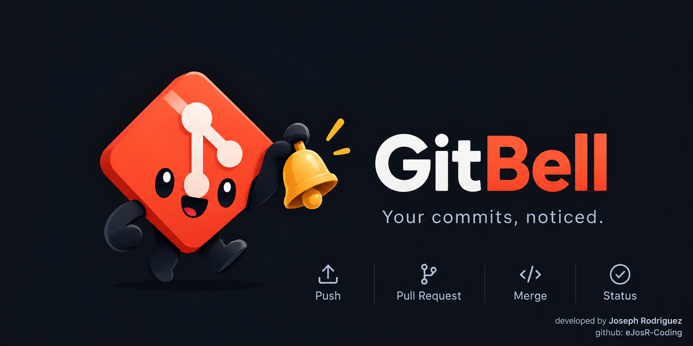

<p align="center">
  
</p>

# GitBell

/ˈɡɪt.bɛl/ (*git-bell*)
noun

1. a small desktop companion that rings when something happens in your repos.

[](https://github.com/eJosR-Coding/gitbell/actions/workflows/ci.yml)
[](https://github.com/eJosR-Coding/gitbell/releases)
[](LICENSE)
[](https://tauri.app)


GitBell is a lightweight desktop app that lives in your system tray and pops a
**native notification** the moment someone pushes, opens a pull request,
reviews, merges or releases in the repositories and organizations you care
about.

No server, no webhooks, no browser tab left open. Your machine asks GitHub
directly with your own token, once a minute, and the operating system shows
the toast. That's it.

## Features ⭐

- **Native toasts** on Linux (freedesktop) and Windows (WinRT). Clicking a
  toast on Linux opens the commit, PR or issue on GitHub.
- **Tray-first.** The window is only for settings. Close it and GitBell keeps
  watching from the tray. Left click reopens it, right click for the menu.
- **Watch what you want.** A single repo (`owner/repo`), a whole organization
  (`org:name`) or everything you watch and follow (`@me`).
- **Pick your events.** Pushes, pull requests, reviews, issues, comments,
  branches and tags, releases, stars and forks. Each one is a toggle.
- **Sounds.** Two bundled chimes, a different one per event category, volume
  control, or bring your own audio file.
- **A mascot that rings its bell.** The tray icon plays a short animation when
  something new arrives. Because why not.
- **Polite polling.** Honors GitHub's `X-Poll-Interval`, uses ETags so
  unchanged polls cost zero rate limit, and backs off automatically when
  throttled.
- **No spam on first run.** Adding a busy organization remembers where it is
  instead of dumping the last 90 days on you.
- **Starts with your session**, minimized to the tray, if you want it to.
- **English and Spanish.** Follows your system language, or pick one in settings.
- **Tiny.** Built with Tauri v2: a few megabytes, not a bundled browser.

## How it works 🔔

```
┌──────────┐   every 60 s, with ETag   ┌────────────────────┐
│ GitBell  │ ────────────────────────▶ │ api.github.com     │
│ (tray)   │ ◀──────────────────────── │ /repos/:r/events   │
└────┬─────┘   200 new events / 304    │ /orgs/:o/events    │
     │                                  │ /users/:u/received │
     │ diff against last seen id        └────────────────────┘
     ▼
┌──────────┐
│ OS toast │  + sound + tray animation
└──────────┘
```

GitBell reads the public [GitHub Events API](https://docs.github.com/en/rest/activity/events).
It keeps the id of the newest event it has seen per target and only notifies
for events newer than that. Your token never leaves your machine except to
call `api.github.com`.

## Installation 💾

Grab the latest installer from the [Releases](https://github.com/eJosR-Coding/gitbell/releases) page:

| Platform | Package |
|---|---|
| Linux | `.deb`, `.rpm`, `.AppImage` |
| Windows | `.msi`, `.exe` |
| macOS | coming soon (the CI matrix entry is one uncomment away) |

### Token

GitBell needs a GitHub personal access token so it can see private repos and
organization activity.

1. GitHub → Settings → Developer settings → Personal access tokens → Tokens (classic)
2. Scopes: `repo` (private repositories) and `read:org` (organization events)
3. Paste it into GitBell → **Cuenta** → **Guardar y verificar**

The token goes straight into your OS keyring (KWallet / GNOME Keyring on
Linux, Credential Manager on Windows). Settings live in the app data
directory (`~/.local/share/dev.ejos.gitbell/` on Linux,
`%APPDATA%\dev.ejos.gitbell\` on Windows) and never contain the token.

### Targets

| Syntax | Watches |
|---|---|
| `owner/repo` | one repository |
| `org:name` | every repository in an organization you belong to |
| `@me` | everything you watch or follow (your received-events feed) |

## Architecture 🧱

```
src/                       TypeScript, runs in the webview
├── core/                  pure logic, no Tauri imports
│   ├── github.ts          Events API client: ETag, X-Poll-Interval, rate limit
│   ├── poller.ts          the loop, dedupe by last seen event id
│   ├── format.ts          GitHub event → toast title/body/url
│   └── types.ts           shared shapes and defaults
├── platform/              thin wrappers over Tauri commands and plugins
│   ├── secrets.ts         token in the OS keyring
│   ├── settings.ts        JSON store for settings and state
│   ├── notify.ts          toasts and tray animation
│   └── sounds.ts          audio playback
├── ui/                    settings window, no framework
└── main.ts                wires the three layers together

src-tauri/src/             Rust, the trusted side
├── lib.rs                 builder, plugins, window lifecycle
├── tray.rs                tray icon, menu, bell animation
├── notify.rs              freedesktop toasts with click-to-open
├── secrets.rs             keyring get/set/delete
└── sounds.rs              validated import of user audio files
```

Rust stays thin on purpose. Anything that doesn't need OS access lives in
`src/core`, which has no Tauri imports and is trivially unit-testable.

## Security 🔒

The webview is treated as untrusted and Rust is the authority. Token in the
OS keyring, least-privilege capabilities, opener scoped to `github.com`,
asset protocol scoped to the app's own sounds folder, strict CSP, and
`cargo audit` plus Dependabot in CI. Details in [SECURITY.md](SECURITY.md).

## Building from source 🛠

Prerequisites: Rust stable, Node 22, pnpm, and the
[Tauri system dependencies](https://tauri.app/start/prerequisites/) for your OS.

```sh
git clone https://github.com/eJosR-Coding/gitbell.git
cd gitbell
pnpm install
pnpm tauri dev      # dev build with hot reload
pnpm tauri build    # installers land in src-tauri/target/release/bundle/
```

On Fedora the system libraries are:

```sh
sudo dnf install webkit2gtk4.1-devel libappindicator-gtk3-devel librsvg2-devel dbus-devel
```

Tests:

```sh
pnpm test                                        # TypeScript core (Vitest)
cargo test --manifest-path src-tauri/Cargo.toml  # Rust
```

## Releasing 🚀

```sh
git tag v0.1.0
git push --tags
```

The release workflow builds Linux and Windows installers on GitHub-hosted
runners and attaches them to a draft release. You don't need a Windows machine.

## Roadmap 🗺

- [ ] macOS builds and notarization
- [ ] "Unread" dot on the tray icon until you open the window
- [ ] Do-not-disturb schedule
- [ ] Per-branch filters (`main` yes, `feature/*` no)
- [ ] Optional in-app toast window with the animated mascot

## Contributing 💬

Issues and pull requests are welcome. Read [CONTRIBUTING.md](CONTRIBUTING.md)
for the project layout and a few ground rules.

## Support GitBell 💗

If GitBell saves you from refreshing GitHub one more time, a ⭐ on the repo
goes a long way.

## License

GitBell is released under the [MIT License](LICENSE).

Developed by **Joseph Rodriguez** · [@eJosR-Coding](https://github.com/eJosR-Coding)
